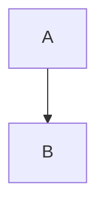

# Artifacts

Cloudflare Worker that publishes and renders reports
stored in the `artifacts` R2 bucket.

Markdown is rendered as HTML and published with a 1200×630 social preview
image. HTML documents are served as published, with the same social preview
captured from the document itself and its tags injected into `<head>`.
Everything else is served as stored bytes.

## Architecture

- R2 bucket: `artifacts`, private, reached through a Worker binding
- Browser Run: renders a 1200×630 PNG for every Markdown report
- Publisher authentication: bearer key from the `PUBLISH_KEYS` secret
- Report access: by URL
- Hostnames: `https://artifacts.yearn.dev` (custom domain) and
  `https://yearn-artifacts.<account>.workers.dev` (kept enabled alongside it,
  since existing report URLs on that domain must keep working)

The Worker is the only thing holding bucket access, so publishers never see S3
credentials. Revoking a publisher means dropping its key from `PUBLISH_KEYS`.
The generated PNG is exposed through the report's `og:image` and Twitter Card
metadata.

## Names

Post to any file name. Only the extension is read, and it decides the content
type the report is served with. The report is stored under a retention prefix
and a random name:

```text
<retention>/<32 hex characters>.<ext>
```

The default public URL omits its internal `archive/` prefix. Unprefixed reads
check `archive/` first, then `30d/` for existing links. Explicit tier URLs read
only that tier. Existing reports keep their original retention.

## Endpoints

```text
GET    /                  read the landing page
GET    /<name>            read a report
POST   /<anything>.<ext>  publish a report
DELETE /<name>            unpublish a report
```

Reads are cached for 24 hours. A stored name is never reused, so a published
report never changes.

Cache entries are scoped to a render version, so a change to the report
template takes effect on existing reports rather than waiting out the cache.
Bump `RENDER_VERSION` in `src/index.ts` when the rendered output changes.

## Diagrams

Markdown reports can include [Mermaid](https://mermaid.js.org) diagrams in
fenced code blocks:

````text

````

Diagrams render in the browser, matching the page theme, and appear in the
social preview image. A diagram that fails to parse falls back to its source
code block.

The [diagram gallery](https://artifacts.yearn.dev/archive/c5b75a4b2745d0a3fc363093099a2c28.md)
is a published report demonstrating nine diagram types — flowchart, sequence,
state, pie, xychart, git graph, timeline, quadrant, and mindmap:

[](https://artifacts.yearn.dev/archive/c5b75a4b2745d0a3fc363093099a2c28.md)

## Retention

Reports have no automatic expiration by default (archive). A path prefix selects
an expiration when publishing:

```text
/1d/<name>        1 day
/7d/<name>        7 days
/30d/<name>       30 days
/90d/<name>       90 days
/1y/<name>        1 year
/<name>           no automatic expiration (default)
/archive/<name>   no automatic expiration
```

R2 lifecycle rules apply to matching internal object prefixes and perform the
deletion automatically. Lifecycle deletion is asynchronous and may take about
24 hours after the displayed expiration date. Archive reports remain removable
through the owner-authenticated DELETE endpoint (reports without owner metadata
cannot be deleted).

The lifecycle configuration also aborts incomplete multipart uploads after
seven days. The Worker never starts multipart uploads, so that rule is
defensive hygiene for the bucket, not part of report retention.

## Setup

Install dependencies (this repository uses **bun**):

```bash
bun install
```

Create the private R2 bucket:

```bash
bun run provision
```

### Publish keys

`PUBLISH_KEYS` is a comma-separated list held in Doppler project
`yearn-artifacts`, config `prd`, with visibility **Masked**. Every deploy pushes
every value in that config to the worker with `wrangler secret bulk` before
`wrangler deploy`, so Doppler is the single source of truth — edit the list
there and let a deploy carry it.

Each key is `[client]--[64 hex characters]`, one per publisher so each can be
revoked on its own. Generate one with:

```bash
echo "[client]--$(openssl rand -hex 32)"
```

Unlike `wrangler secret put`, the Doppler value *can* be read back, so adding a
publisher no longer means re-entering every existing key. Revoking a publisher
means dropping its key from the Doppler value and deploying.

Two caveats from the shared workflow:

- The sync is additive. A key removed from Doppler stays on the worker until
  someone runs `wrangler secret delete`.
- A `wrangler secret put` made by hand is reverted on the next deploy.

### Deploy

A push to `main` deploys through the shared `yearn/yearn-gha` Cloudflare
workflow, which authenticates to Doppler with OIDC. It is the only deploy path
— there is no `workflow_dispatch` and no Cloudflare token in GitHub. The shared
`CLOUDFLARE_API_TOKEN` and `CLOUDFLARE_ACCOUNT_ID` come from Doppler
`webops-shared-prod` / `cloudflare-deploy-configs`.

Repository variable `DOPPLER_PRODUCTION_IDENTITY_ID` holds the production
Doppler identity; identity IDs are not secrets. See
`yearn-gha/specs/doppler-cloudflare.md` for the identity's required claims.

## Publish a Report

```bash
curl -X POST "$ARTIFACTS_URL/REPORT.md" \
  -H "Authorization: Bearer $PUBLISH_KEY" \
  -H "Content-Type: text/markdown" \
  -H "X-Report-Repository: owner/repo" \
  -H "X-Report-Scanner: socket" \
  -H "X-Report-Ref: main" \
  -H "X-Report-Commit: $GITHUB_SHA" \
  -H "X-Report-Model: claude-opus-5" \
  -H "X-Report-Effort: high" \
  -H "X-Report-Confidential: true" \
  --data-binary @REPORT.md
```

The command prints JSON:

```json
{
  "key": "9f2c41d7ab3e5806d1f4c92b7e0a5643.md",
  "url": "https://<worker>/9f2c41d7ab3e5806d1f4c92b7e0a5643.md"
}
```

Open that URL to read the rendered report.

To select another retention tier, include it before the posted name:

```bash
curl -X POST "$ARTIFACTS_URL/7d/REPORT.md" \
  -H "Authorization: Bearer $PUBLISH_KEY" \
  -H "Content-Type: text/markdown" \
  --data-binary @REPORT.md
```

The returned read and delete URL will include the same `/7d/` tier.

## Unpublish a Report

```bash
curl -X DELETE "$ARTIFACTS_URL/9f2c41d7ab3e5806d1f4c92b7e0a5643.md" \
  -H "Authorization: Bearer $PUBLISH_KEY"
```

This removes the object and its cached copy. Deleting straight from R2 would
leave the edge serving the report for up to a day.

DELETE authenticates the complete bearer token against `PUBLISH_KEYS`, then
compares its client ID with the artifact's stored `publisherClientId`. Client IDs
are case-sensitive and cannot contain `--`; the first `--` separates the client
ID from the API key. Both parts must be nonempty and contain no whitespace.
New publications and their thumbnails receive this owner metadata from the
authenticated token, never from caller-supplied report headers.

A rotated key with the same client ID can delete that client's artifacts.
Missing or invalid credentials return `401`; a different owner or missing owner
metadata returns `403`. Older ownerless artifacts cannot be deleted through the
Worker; their lifecycle expiration still applies. There is no admin override.
If no target object exists, DELETE returns `404`.

Unprefixed DELETE checks both `archive/` and `30d/`, including thumbnails, before
removing anything. Every existing target must belong to the authenticated client.
Explicit tier URLs check only that tier. Direct thumbnail deletion uses the same
ownership check.

## Provenance

Stored names are random, so listing the bucket says nothing about what a report
is. The optional `X-Report-*` headers are stored as R2 custom metadata:

```text
repository  scanner  ref  commit  model  effort  name  confidential
```

`name` defaults to the posted file name. Values are trimmed to 512 characters,
and unknown `X-Report-*` headers are ignored. The rendered report shows this
line in its footer, falling back to the stored name when no metadata was sent.
`model` and `effort` record the model that wrote the report and its reasoning
effort; the footer shows them under the provenance line as `model (effort)`.
A missing model shows as `unknown`, and a missing effort drops the parentheses.
When `confidential` is exactly `true`, rendered Markdown and its social preview
show a `Yearn Confidential — Do Not Distribute` notice. Unset, `false`, and
other values do not show the notice. This is a visual label, not access control.

## Access

Writes require a bearer key. **Reads are not authenticated** — anyone with a
report URL can read it. There is no index, and report names are
random, so a report is only reachable by the URL the publish returned. Treat report URLs as secrets.

To gate reads later, put a Cloudflare Access application in front of
`artifacts.yearn.dev`.
